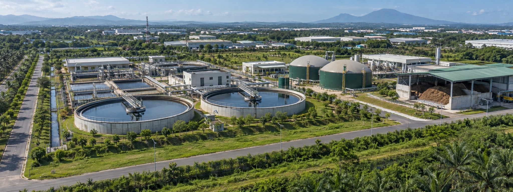
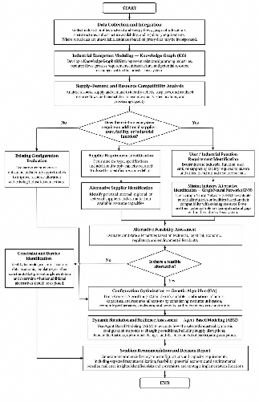
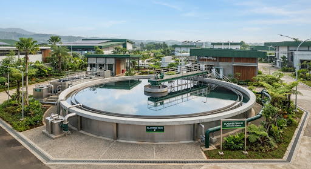
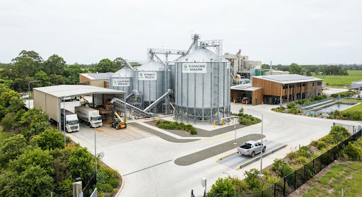
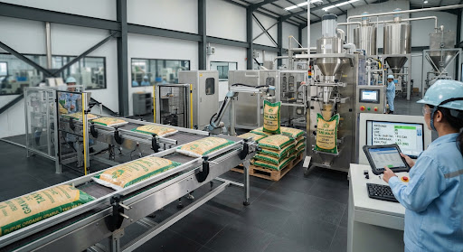

# Symbion v2.0 — Industrial Symbiosis Decision Support System

<div align="center">


### *AI-Driven Decision Engine for Resilient Industrial Symbiosis & Circular Economy*

[](https://github.com/ClaveAP/symbion-v2)
[](https://ipb.ac.id)
[](https://nextjs.org)
[](https://www.typescriptlang.org)
[](https://tailwindcss.com)
[-emerald?style=for-the-badge&logo=checkmarx)](https://github.com/ClaveAP/symbion-v2)

<br />

**Symbion v2.0** is an ex-ante decision evaluation engine that bridges industrial waste/byproduct generators, bio-refining conversion hubs, and commercial off-takers into zero-waste, economically resilient circular clusters.

[Ringkasan Cepat (Bahasa Indonesia)](#-ringkasan-singkat-bahasa-indonesia) • [Methodology & 4 AI Pillars](#-the-4-ai-pillars-methodological-engine) • [Flagship Cases](#-flagship-empirical-research-cases) • [System Tour](#-key-modules--interactive-workspaces) • [Quickstart](#-quickstart-guide)

</div>

---

## 🇮🇩 Ringkasan Singkat (Bahasa Indonesia)

> **Apa itu Symbion?**  
> **Symbion** adalah platform *Decision Support System* (Sistem Pendukung Keputusan) berbasis Kecerdasan Buatan (AI) yang menghubungkan pabrik penghasil limbah industri (*upstream*), fasilitas pengolahan bio-energi/konversi (*processing*), dan pembeli komersial (*downstream off-takers*).
>
> Proyek ini dikembangkan oleh tim riset **Departemen Teknik Sistem Industri, Institut Pertanian Bogor (IPB University)** dan dipersiapkan untuk kompetisi internasional **I-SINERGIE MALAYSIA 2026**.

### Masalah Nyata yang Diselesaikan:
1. **Limbah Industri Terbuang Sia-Sia**: Jutaan ton limbah industri (seperti abu batubara *fly ash*, limbah cair sawit POME, ampas tebu, dan limbah organik pasar) menumpuk di kolam pembuangan dan mencemari lingkungan.
2. **Pabrik Pengolah Mengalami Defisit Pasokan**: Pabrik biogas (CBG) dan bio-refinery sering kali beroperasi di bawah kapasitas terpasang (hanya $50-55\%$) karena pasokan bahan baku yang fluktuatif dan rantai pasok yang terputus.
3. **Kerahasiaan Data Perusahaan**: Pabrik ragu membagikan data limbahnya secara terbuka karena takut membocorkan rahasia dapur produksi.
4. **Solusi Symbion**: Menggunakan **Knowledge Graph (KG)** untuk menjaga privasi data, **Graph Neural Networks (GNN)** untuk mendeteksi industri perantara yang hilang, **Genetic Algorithm (GA)** untuk optimasi rute & valuasi ekonomi, serta **Agent-Based Modeling (ABM)** untuk menguji ketahanan jika terjadi krisis pasokan ($-20\%$ hingga $-80\%$).

---

## 📌 Executive Summary (International Context)

In conventional industrial parks, up to **62% of solid byproducts** and millions of cubic meters of high-COD effluents remain unutilized or landfilled. Conversely, commercial bio-methanation and conversion plants frequently operate at **severe capacity deficits (50–55% utilization)** due to feedstock fragmentation, seasonal volatility, and strict commercial confidentiality barriers.

**Symbion v2.0** transforms fragmented industrial estates into self-balancing, eco-industrial symbiotic networks. It replaces manual, static "yellow pages" matching with a dynamic algorithmic platform that optimizes mass balances, verifies chemical compatibility, simulates supply shock resilience, and audits avoided carbon emissions.

<div align="center">
  
  <p><em>Subang Smartpolitan Axis: Integrated Bio-Energy & Byproduct Circular Ecosystem</em></p>
</div>

---

## 🧠 The 4 AI Pillars (Methodological Engine)

Symbion's decision intelligence is anchored on an academic framework combining four computational pillars:

<div align="center">
  
  <p><em>Symbion Multi-Tier Decision Framework (Data Integration ➔ KG ➔ GNN ➔ GA ➔ ABM ➔ Policy Synthesis)</em></p>
</div>

| AI Pillar | Core Mechanism | Purpose & Implementation |
| :--- | :--- | :--- |
| **Pillar 1: Knowledge Graph (KG)** | *Multi-Relational Topology* | Ingests plant data, stream enthalpy, COD/moisture parameters, and transport networks while preserving proprietary confidentiality through anonymized park-level aggregation. |
| **Pillar 2: Graph Neural Networks (GNN)** | *Missing Industry Discovery* | Evaluates latent graph embeddings to recommend missing conversion nodes (e.g., CSTR Anaerobic Digesters, Biomass Densifiers, Fly Ash Geopolymer Sinks) to close open material loops. |
| **Pillar 3: Genetic Algorithm (GA)** | *Multi-Objective Pareto Optimization* | Solves non-linear trade-offs among resource recovery, transport logistics costs, gross product revenue ($V_{\text{gross}}$), and net avoided carbon emissions ($E_{\text{avoided}}$). |
| **Pillar 4: Agent-Based Modeling (ABM)** | *Dynamic Perturbation Stress Testing* | Simulates operational resilience under acute upstream supply disruptions ($-20\%$ to $-80\%$), unscheduled equipment downtime, and downstream off-take cancellations. |

---

## 📊 Flagship Empirical Research Cases

Symbion features pre-loaded empirical datasets based on peer-reviewed government audits and field facilities:

### 1. GAIL Compressed Biogas (CBG) Facility — Jhiri, Ranchi (Input Deficit Anchor)
- **Baseline Challenge**: Commercial anaerobic facility designed for $150.0\text{ t/day}$ wet organic waste, operating at only $80.0\text{ t/day}$ initial intake (**$53.33\%$ capacity utilization**, a $70.0\text{ t/day}$ operational deficit).
- **Symbion Solution**: Matches secondary agro-wholesale mandi waste ($+52.5\text{ t/day}$ at $\alpha = 75\%$), restoring utilization to **$88.33\%$** ($+65.6\%$ relative gain).
- **Verified Environmental & Financial Gains**:
  - **Avoided Carbon Emissions**: **$1,685\text{ tCO}_2\text{e/year}$** (equivalent to sequestering $27,500$ trees or removing $360$ gasoline cars annually).
  - **Renewable Energy Yield**: **$1,650\text{ t/year CBG}$** ($85,800\text{ GJ/year}$) injected into city gas networks.
  - **Circular Bio-Fertilizer**: **$8,250\text{ t/year}$** Fermented Organic Manure (FOM) distributed to regional agriculture.
  - **Gross Value**: **₹4.21 Crore/year** ($\approx \text{RM } 2.37\text{M}$ / $\text{IDR } 7.99\text{B}$ / $\text{USD } 505\text{k}$).

### 2. NTPC Gadarwara Super Thermal Power Station (2 × 800 MW) (Output Surplus Sink)
- **Baseline Challenge**: Generates $1.685\text{M t/year}$ of pulverized coal combustion fly ash. Baseline PPC cement absorbs only $634.3\text{k t/year}$ ($37.64\%$), leaving **$1.05\text{M t/year}$ ($62.35\%$) unutilized in slurry ponds**.
- **Symbion Solution**: Optimizes allocation across secondary circular sinks: geopolymer bricks, highway embankments, and precast civil engineering components.

### 3. Subang Smartpolitan Agro-Industrial Axis (West Java, Indonesia)
- Evaluates multi-feedstock anaerobic co-digestion combining Palm Oil Mill Effluent (POME: $5,000\text{ m}^3\text{/month}$, COD $> 45,000\text{ mg/L}$), Empty Fruit Bunches (EFB: $800\text{ t/month}$), sugarcane bagasse, and poultry manure.

<div align="center">
  <table>
    <tr>
      <td align="center"><br /><b>POME Treatment Hub</b></td>
      <td align="center"><br /><b>Biomass Bagasse Depot</b></td>
      <td align="center"><br /><b>Organic Granulation Plant</b></td>
    </tr>
  </table>
</div>

---

## 🚀 Key Modules & Interactive Workspaces

| Workspace Route | View Name | Key Interactive Features |
| :--- | :--- | :--- |
| **`/`** | **Executive Overview** | High-level synthesis, 4 Hero KPI metric cards, draggable Circular Material Flow Network with dynamic cubic Bezier curves, and real-time Feasibility Card. |
| **`/topology`** | **Topology Studio** | Draggable bipartite SVG graph of upstream suppliers, conversion nodes, and off-takers. Real-time Bezier re-routing, material vs. energy stream filters, and mass-balance telemetry. |
| **`/scenarios`** | **Ex-Ante Gap Matrix** | Interactive 4-column scenario evaluation table with live $\alpha \in \{50\%, 75\%, 100\%\}$ switching and custom parameter sandbox modal. |
| **`/impact`** | **Carbon Accounting & Valuation** | Certified GHG protocol ledger ($1,685\text{ tCO}_2\text{e}$), 3-step circular transformation story, 5-feedstock progress breakdown, and 1-click PDF audit export. |
| **`/stress-test`** | **Resilience Stress Lab** | Sensitivity shock slider ($-20\%$ to $-80\%$ supply disruption), operational downtime simulation, and composite feasibility index (**Score: 94/100 Grade A+**). |
| **`/input-data`** | **Data Integration Hub** | Feedstock registration wizard (Step 1/2) with physicochemical tags, AI Model Matching v2.4, and interactive verified waste stream directory. |
| **`/methodology`** | **Academic E-Digest Dossier** | Full academic paper documentation, 14 thermodynamic & economic formulas, 4 AI pillar breakdowns, and 8 Scopus/governmental empirical references. |
| **`/login`** | **Dual-Role Auth Portal** | Interactive role switcher (**Mitra Kawasan / Regional Partner** vs. **Admin Pengelola / Master Estate Admin**), pre-filled demo accounts, and onboarding modals. |

---

## 🌐 Tri-Currency Real-Time Valuation

All financial metrics dynamically convert across three international currencies via a centralized toggle:
- **MYR (RM)**: Host country currency for **I-SINERGIE Malaysia 2026**.
- **IDR (Rp)**: Operational base currency for Indonesian agro-industrial facilities.
- **USD ($)**: Global benchmark for international green finance and ESG investments.

---

## 🛠️ System Architecture & Tech Stack

```
symbion-v2/
├── public/images/             # High-res ecosystem imagery, methodology diagrams & brand logos
├── src/
│   ├── app/
│   │   ├── page.tsx           # Executive Overview & Draggable Topology Studio
│   │   ├── topology/page.tsx  # Full-Screen Interactive Topology Studio
│   │   ├── scenarios/page.tsx # Ex-Ante Scenario Gap-Fulfillment Matrix (α = 50%, 75%, 100%)
│   │   ├── impact/page.tsx    # Certified Carbon Accounting & Multi-Currency Ledger
│   │   ├── stress-test/       # Sensitivity Shock Simulator (Score 94/100 Grade A+)
│   │   ├── input-data/        # Waste Stream Registration Wizard & AI Matcher
│   │   ├── login/page.tsx     # Role-Differentiated Authentication Portal
│   │   └── methodology/       # Theoretical Formulas, Equations & Research Paper
│   ├── components/
│   │   ├── interactive/       # Draggable SVG Bezier canvas, shock sliders, sandbox modal
│   │   ├── layout/            # Role-aware Sidebar, Header, AppShell, UserProfileMenu
│   │   └── ui/                # MetricCards, StatusBadges, CurrencyToggle
│   ├── context/               # SymbionContext (cases, alpha, currency) & UserSessionContext
│   ├── lib/                   # Empirical datasets, currency conversion rates, thermodynamic equations
│   └── types/                 # Domain TypeScript interfaces
```

- **Frontend Framework**: Next.js 14.2 (App Router, Modular Multi-Page architecture)
- **Language**: TypeScript 5 (Strict type safety, zero ESLint breakages)
- **Styling**: Tailwind CSS 3.4 with 8-point typographic hierarchy (`Hanken Grotesk`, `Inter`, `JetBrains Mono`)
- **Visuals & Polish**: Lucide React & Canvas Confetti micro-interactions

---

## ⚡ Quickstart Guide

### Prerequisites
- **Node.js**: `v18.18.0` or higher
- **npm** / **yarn** / **pnpm**

### Installation & Run
```bash
# 1. Clone the repository
git clone https://github.com/ClaveAP/symbion-v2.git
cd symbion-v2

# 2. Install dependencies
npm install

# 3. Start local development server
npm run dev
```

Visit [http://localhost:3000](http://localhost:3000) in your browser.

### Production Build Verification
```bash
# Audits type safety and compiles all 12 static routes with 0 errors
npm run build
```

---

## 👥 Research Team & Academic Citation

Developed at the **Department of Industrial Systems Engineering, IPB University**, Bogor, Indonesia:

- **Zamzam Nurcahyo** — *Principal Investigator* (`nczamzam@apps.ipb.ac.id`)
- **Kayla Rahma Faiza** — *Process Simulation* (`101006kayla@apps.ipb.ac.id`)
- **Dhamar Syamhudi Anggoro** — *Optimization & Genetic Algorithm* (`dhamar11syamhudi@apps.ipb.ac.id`)
- **Trias Aldi Prasetia** — *Techno-Economic Analysis* (`prasetiaalditrias@apps.ipb.ac.id`)
- **Agung Prayudha Hidayat** — *Industrial Systems Engineering* (`agungprayudha@apps.ipb.ac.id`)

### Academic Citation (APA 7th Edition)
```bibtex
@article{symbion2026,
  title={Symbion: AI-Driven Decision Support for Resilient Industrial Symbiosis},
  author={Nurcahyo, Zamzam and Faiza, Kayla Rahma and Anggoro, Dhamar Syamhudi and Prasetia, Trias Aldi and Hidayat, Agung Prayudha},
  journal={Department of Industrial Systems Engineering, IPB University},
  note={Prepared for I-SINERGIE Malaysia 2026},
  year={2026}
}
```

---

## 📄 License & Attribution

Symbion v2.0 is an academic and competitive innovation project registered for **I-SINERGIE Malaysia 2026**.  
Copyright © 2026 IPB University Research Team. All rights reserved.
